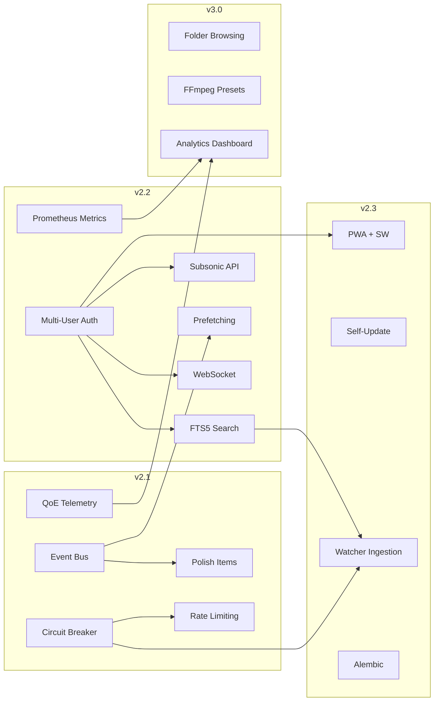

# NEOTOKYO FM — v3 Growth & Evolution Plan

> **Stable baseline**: v2.0 (current)
> **Phases**: v2.1 (next) → v2.2 (growth) → v2.3 (offline & self-healing) → v3.0 (scale)
>
> This plan synthesizes the existing roadmap (`docs/v2_plan.md`, `docs/FUTURE_UPGRADES.md`)
> with the private vision documents (`docs/private/system_architecture_blueprint.pdf`,
> `docs/private/automated_agentic_ecosystem.md`) into a single executable plan.

---

## Table of Contents

1. [Architecture Overview](#1-architecture-overview)
2. [Phase 1 — v2.1: Foundation & Polish](#2-phase-1--v21-foundation--polish)
3. [Phase 2 — v2.2: Growth Enablement](#3-phase-2--v22-growth-enablement)
4. [Phase 3 — v2.3: Offline & Self-Healing](#4-phase-3--v23-offline--self-healing)
5. [Phase 4 — v3.0: Scale & Advanced Features](#5-phase-4--v30-scale--advanced-features)
6. [Future Considerations (Deferred)](#6-future-considerations-deferred)
7. [File Inventory](#7-file-inventory)
8. [Implementation Order & Dependencies](#8-implementation-order--dependencies)

---

## 1. Architecture Overview

### Current Architecture (v2.0)

```
┌─────────────┐    HTTP/JSON     ┌──────────────┐
│   Player     │ ◄─────────────► │   Grabber     │
│  (React)     │   localhost:5050 │   (Flask)     │
└──────┬──────┘                  └──────┬───────┘
       │                                │
       ▼                                ▼
   Browser Audio                    Downloaded Files
```

### Target Architecture (v3.0)

```
┌──────────────────────────────────────────────────────────────┐
│                      Event Bus (eventBus.ts)                 │
│   player  │  lyrics  │  queue  │  admin  │ telemetry │ social │
└───────────┴──────────┴─────────┴─────────┴───────────┴───────-┘
       │          │          │         │          │         │
       ▼          ▼          ▼         ▼          ▼         ▼
  AudioEngine  LyricsPanel QueuePanel  Admin     Telemetry [future]
  +prefetchCache            +reorder   +WS       +beacon

┌──────────────┐  HTTP/WS  ┌──────────────────────────────────┐
│   Player     │ ◄───────► │         Grabber (Flask)          │
│  (React+PWA) │           │  ┌────────────────────────────┐  │
│  +SW+IndexedDB│           │  │ Circuit Breakers           │  │
└──────────────┘           │  │ Rate Limiters              │  │
                           │  │ Prometheus Metrics         │  │
                           │  │ Multi-User Sessions        │  │
                           │  │ Subsonic API               │  │
                           │  │ Self-Update Engine         │  │
                           │  └────────────────────────────┘  │
                           │  ┌────────────────────────────┐  │
                           │  │ Workers                    │  │
                           │  │  • Watcher (auto-ingest)   │  │
                           │  │  • Download (yt-dlp)       │  │
                           │  │  • Metadata (MusicBrainz)  │  │
                           │  │  • ICY Poller              │  │
                           │  └────────────────────────────┘  │
                           │  ┌────────────────────────────┐  │
                           │  │ Storage                    │  │
                           │  │  • SQLite + FTS5           │  │
                           │  │  • Session Store (SQLite)  │  │
                           │  │  • Sidecar Metadata        │  │
                           │  │  • QoE Telemetry DB        │  │
                           │  └────────────────────────────┘  │
                           └──────────────────────────────────┘
```

### Design Principles

1. **Incremental over Rewrite** — No framework migrations. Stay on Flask + React.
2. **Private Vision → Pragmatic** — The agentic ecosystem vision (Kafka, k8s, CDN, Go transcoders) informs the architecture but is pared down to what a self-hosted single-server app actually needs.
3. **Backward Compatible** — Every phase is deployable independently. No breaking changes.
4. **Resilience via Simplicity** — Circuit breakers, rate limits, and healthchecks > full mesh of microservices.
5. **Pluggable Future** — The `social` event bus channel and the ingestion pipeline both have placeholder hooks so they can be fleshed out without touching core playback code.

---

## 2. Phase 1 — v2.1: Foundation & Polish

### 2.1 Typed Event Bus

**Why**: The private vision calls for micro-frontend resilience via RxJS. Currently `notificationBus.ts` is a bare `Set<Listener>`. Upgrade to a typed, channel-based event bus that decouples UI components. The `social` channel is reserved for future use.

| File | Action |
|------|--------|
| `client/src/services/notificationBus.ts` | **Replace** with `eventBus.ts` |
| `client/src/services/audioEngine.ts` | Emit player lifecycle events |
| `client/src/components/ui/StreamToast.tsx` | Subscribe via `admin:toast` channel |
| `client/src/App.tsx` | Init bus on mount |

**Event Bus API (new `client/src/services/eventBus.ts`):**

```typescript
type EventChannel = 'player' | 'lyrics' | 'queue' | 'admin' | 'telemetry' | 'audio' | 'social'

// Subscribe to a channel
function on(channel: EventChannel, event: string, handler: (data: any) => void): () => void

// Emit an event
function emit(channel: EventChannel, event: string, data?: any): void

// Reserved channels:
//   social:*  — no handlers registered, reserved for future social feature
```

**Channel events:**

| Channel | Events |
|---------|--------|
| `player` | `play`, `pause`, `stop`, `seek`, `volume`, `stall`, `error` |
| `queue` | `add`, `remove`, `reorder`, `clear` |
| `lyrics` | `sync`, `offset`, `load` |
| `admin` | `toast`, `download`, `update-available` |
| `telemetry` | `beacon` |
| `audio` | `engine-ready`, `engine-destroy` |
| `social` | *(reserved — no subscribers)* |

### 2.2 QoE Client Telemetry

**Why**: The private plan's "Telemetry Probes" — start with client-side playback quality metrics. This is the foundation for proactive self-healing.

**Client-side (`client/src/services/trackTelemetry.ts`):**

- Track per-session metrics:
  - `time-to-first-frame` (ms from play click to `timeupdate` > 0)
  - `stall-count` (number of `waiting` / `stalled` events)
  - `stall-duration` (cumulative ms spent stalled)
  - `playback-errors` (count of `error` events)
  - `bitrate` (inferred from download speed)
- Buffer up to 10 events or 30s, then send via `navigator.sendBeacon('POST /api/telemetry', payload)`
- Also send `visibilitychange` → `hidden` flush
- Respect `navigator.connection.effectiveType` (4g/3g/2g/slow-2g)

**Server-side:**

| File | Action |
|------|--------|
| `server/models/db.py` | Add `qoe_events` table |
| `server/routes/admin.py` | Add `POST /api/telemetry` endpoint |
| `server/config.py` | Add `TELEMETRY_SAMPLE_RATE` env var (default 100, 1–100% sample) |

**`qoe_events` table schema:**

```sql
CREATE TABLE IF NOT EXISTS qoe_events (
    id INTEGER PRIMARY KEY AUTOINCREMENT,
    session_id TEXT NOT NULL,
    event_type TEXT NOT NULL,     -- 'ttff', 'stall', 'error', 'bitrate'
    value REAL NOT NULL,          -- ms, count, kbps
    metadata TEXT DEFAULT '{}',   -- JSON: { track, url, source, conn_type }
    client_ts TEXT NOT NULL,      -- ISO 8601 from client
    server_ts TEXT DEFAULT (datetime('now')),
    ip TEXT DEFAULT ''
);
CREATE INDEX idx_qoe_event_type ON qoe_events(event_type);
```

### 2.3 Generalized Circuit Breaker

**Why**: Currently only LRCLIB has a circuit breaker. Extract as reusable utility for radio, YouTube, webhooks.

**New `server/utils/circuit_breaker.py`:**

```python
class CircuitBreakerState(Enum):
    CLOSED = 'closed'       # Normal operation
    OPEN = 'open'           # Failing — reject fast
    HALF_OPEN = 'half_open' # Testing if recovered

class CircuitBreaker:
    def __init__(self, name: str, threshold: int = 5,
                 cooldown: float = 60.0, half_open_max: int = 1):
        ...

    def __call__(self, func):     # Decorator
    def call(self, func, *args, **kwargs):
    def reset(self):
    def status(self) -> dict:

# Decorator for wrapping sync/async functions
def with_circuit_breaker(name: str, threshold=5, cooldown=60):
    ...
```

| File | Action |
|------|--------|
| `server/utils/circuit_breaker.py` | **New** — `CircuitBreaker` class + `@with_circuit_breaker` decorator |
| `server/services/lrclib.py` | Refactor to use shared `CircuitBreaker` |
| `server/routes/radio.py` | Wrap `radio-proxy` fetch → break after 5 failures, 60s cooldown |
| `server/routes/youtube.py` | Wrap `yt-search`, `expand-playlist` |
| `server/routes/admin.py` | Wrap webhook delivery |

### 2.4 Rate Limiting on Public Endpoints

**Why**: Currently only login is rate-limited. Radio proxy and YouTube search are internet-facing.

| File | Action |
|------|--------|
| `server/utils/security.py` | Extract `@rate_limit(calls, window, key_by='ip')` decorator from login-specific pattern |
| `server/routes/radio.py` | `@rate_limit(30, 60)` on `radio-proxy` |
| `server/routes/youtube.py` | `@rate_limit(20, 60)` on `yt-search` |
| `server/routes/files.py` | `@rate_limit(100, 60)` on `files` list |

The `@rate_limit` decorator:
```python
def rate_limit(calls: int, window: float, key_by: str = 'ip'):
    """Decorator. Tracks per-{key_by} request count in sliding window.
       key_by can be 'ip' (default) or a callable(request) -> str.
       Returns 429 if exceeded."""
```

### 2.5 v2.1 Polish Items (from existing roadmap)

These are already documented in `docs/v2_plan.md` Priority 2 + Future v2.1:

| Feature | Files |
|---------|-------|
| **Scanner progress bar** (SSE stream) | `routes/admin.py`, `AdminScanner.tsx` |
| **Inline metadata editor** | `routes/files.py` (PUT /api/files/\<name\>), `AdminSongs.tsx` |
| **Confirm dialogs** | New `ConfirmDialog.tsx`, all admin pages |
| **Log level filter** (INFO/WARN/ERROR tabs) | `AdminLogs.tsx` |
| **Dark/light theme toggle ** | Wire `playerStore.theme` to player header (already works in admin) |
| **Radio station drag-reorder** | `AdminRadio.tsx`, `routes/radio.py` save order |
| **Radio station genre color badges** | `RadioPage.tsx` |
| **Radio station connectivity test** | `AdminRadio.tsx`, `routes/radio.py` |
| **Station offline graceful handling** | `RadioPage.tsx`, `audioEngine.ts` |
| **Crossfade duration slider** | `playerStore.ts`, new slider UI |
| **Playlist import from URL** | `YouTubePage.tsx`, `routes/youtube.py` |
| **Upload progress bar** | `AdminUploads.tsx` (XHR `upload.onprogress`) |

---

## 3. Phase 2 — v2.2: Growth Enablement

### 3.1 Multi-User Auth + DB-Backed Sessions

**Why**: Prerequisite for growth. Currently single-user with in-memory Flask sessions that don't survive restart.

**Database changes (`server/models/db.py`):**

```sql
CREATE TABLE IF NOT EXISTS users (
    id INTEGER PRIMARY KEY AUTOINCREMENT,
    username TEXT UNIQUE NOT NULL,
    password_hash TEXT NOT NULL,
    role TEXT NOT NULL DEFAULT 'viewer',  -- 'admin' | 'operator' | 'viewer'
    created TEXT DEFAULT (datetime('now'))
);

CREATE TABLE IF NOT EXISTS sessions (
    id INTEGER PRIMARY KEY AUTOINCREMENT,
    user_id INTEGER NOT NULL REFERENCES users(id),
    token_hash TEXT NOT NULL,
    created TEXT DEFAULT (datetime('now')),
    expires TEXT NOT NULL,
    ip TEXT DEFAULT ''
);
CREATE INDEX idx_sessions_token ON sessions(token_hash);
CREATE INDEX idx_sessions_expires ON sessions(expires);
```

**Changes by file:**

| File | Action |
|------|--------|
| `server/models/db.py` | Add `users` + `sessions` tables, CRUD functions |
| `server/routes/auth.py` | Replace Flask session with DB-backed token auth. Register (`POST /api/register`) requires admin token. Login returns `{ token, user }`. All endpoints validate via `Authorization: Bearer <token>` header |
| `server/utils/security.py` | Update `auth_required` decorator to check DB token. Add role-based `@require_role('admin')` variant |
| `server/routes/playlists.py` | Scope playlists by `user_id` |
| `server/routes/downloads.py` | Scope download history by `user_id` |
| `server/routes/admin.py` | Admin-only endpoints require `role='admin'` |
| `client/src/services/grabberAPI.ts` | Store token in localStorage, send as `Authorization` header |
| `client/src/admin/RequireAuth.tsx` | Check token + user role from server |
| `client/src/stores/playerStore.ts` | Add `user: { username, role } \| null` state |

### 3.2 SQLite FTS5 Full-Text Search

**Why**: Current search is client-side array filter. FTS5 enables fast, ranked server-side search across title/artist/album/genre.

**Database:**

```sql
CREATE VIRTUAL TABLE IF NOT EXISTS tracks_fts USING fts5(
    filename, title, artist, album, genre,
    content='',   -- external content, not shadow table
    tokenize='porter unicode61'
);
```

**Changes by file:**

| File | Action |
|------|--------|
| `server/models/db.py` | Create `tracks_fts` on init, add `upsert_track_fts()` and `delete_track_fts()` |
| `server/workers/metadata.py` | After sidecar extraction, call `upsert_track_fts()` |
| `server/routes/files.py` | Enhance `GET /api/search?q=...` to use `SELECT ... FROM tracks_fts WHERE tracks_fts MATCH ? ORDER BY rank` |
| `client/src/pages/LibraryPage.tsx` | Use server-side search instead of client-side filter |
| `client/src/services/grabberAPI.ts` | Add `searchFiles(query: string)` |

### 3.3 Subsonic API

**Why**: Unlocks mobile clients (Sonixd, DSub, Tempo) — documented in v2 Priority 6.

**New `server/routes/subsonic.py`:**

| Endpoint | Route | Response |
|----------|-------|----------|
| `GET /rest/ping` | `/api/subsonic/ping` | `<subsonic-response status="ok">` |
| `GET /rest/getMusicFolders` | `/api/subsonic/getMusicFolders` | Single folder = download dir |
| `GET /rest/getArtists` | `/api/subsonic/getArtists` | Artists from SQLite `artists` table |
| `GET /rest/getAlbumList` | `/api/subsonic/getAlbumList` | Paginated album list by type (alphabetical, newest, recent, frequent) |
| `GET /rest/stream` | `/api/subsonic/stream` | Range-request audio stream (reuses `/api/audio/`) |
| `GET /rest/getCoverArt` | `/api/subsonic/getCoverArt` | Cover image (reuses `/api/cover/`) |
| `POST /rest/scrobble` | `/api/subsonic/scrobble` | Log to `play_log` table |

Auth: Subsonic uses HTTP Basic auth (`?u=user&p=password` or `token`). Map to existing DB users.

| File | Action |
|------|--------|
| `server/routes/subsonic.py` | **New** — all 7 endpoints with XML response formatting |
| `server/routes/__init__.py` | Register `subsonic_bp` |

### 3.4 Lookahead Prefetching

**Why**: The "Zero-Lag Secret" from the private blueprint — prefetch next track audio while current track plays.

**New `client/src/services/prefetchCache.ts`:**

```typescript
class PrefetchCache {
  private cache: Map<string, ArrayBuffer>   // LRU, max 3
  private inflight: Map<string, Promise<ArrayBuffer>>

  prefetch(url: string): void               // Start fetch in background
  get(url: string): ArrayBuffer | null       // Sync check
  evict(url?: string): void                  // Clear all or specific
}
```

**Changes to `client/src/services/audioEngine.ts`:**

- In `onEnd` handler, before calling `playNext()`:
  1. Check `prefetchCache.get(nextTrack.url)` → if hit, create `Blob` URL and set as `audio.src`
  2. If miss, fall back to normal fetch
- After `playTrack()` starts, call `prefetchCache.prefetch(queue[idx+1].url)` and `prefetchCache.prefetch(queue[idx+2].url)`
- On `track end` → crossfade → next track loads from in-memory buffer = zero network latency

**Tracks with different sources:**
- `source === 'local'` — prefetch via `fetch('/api/audio/...')` → `ArrayBuffer`
- `source === 'youtube'` — prefetch via `fetch('/api/yt-proxy/...')` → `ArrayBuffer` (if streaming, prefetch first segment only)
- `source === 'radio'` — no prefetch (infinite stream)

| File | Action |
|------|--------|
| `client/src/services/prefetchCache.ts` | **New** |
| `client/src/services/audioEngine.ts` | Integrate prefetch into play/pause/next flow |
| `client/src/stores/playerStore.ts` | Add `prefetchEnabled: boolean` (persisted, default true) |

### 3.5 WebSocket Real-Time

**Why**: Replace HTTP polling for downloads, logs, scanner, and admin dashboard. Every 600ms poll on downloads is wasteful.

| File | Action |
|------|--------|
| `server/requirements.txt` | Add `flask-socketio` |
| `server/app.py` | Init SocketIO, start with gevent worker |
| `server/routes/__init__.py` | No change — SocketIO events are separate from Blueprints |
| `server/routes/admin.py` | Emit `download:progress`, `log:line`, `scanner:progress` events |
| `server/workers/download.py` | Emit progress updates via SocketIO |
| `client/src/services/socketClient.ts` | **New** — connect on admin login, reconnect with backoff, subscribe to events |
| `client/src/admin/AdminDashboard.tsx` | Switch from 10s polling to WS push |
| `client/src/admin/AdminLogs.tsx` | Switch from 5s polling to `log:line` events |
| `client/src/admin/AdminDownloads.tsx` | Switch from 600ms polling to `download:*` events |
| `client/src/admin/AdminScanner.tsx` | Switch to `scanner:*` events |
| `client/src/components/ui/DownloadProgress.tsx` | Switch to `download:*` events |

**SocketIO events:**

| Event | Direction | Payload |
|-------|-----------|---------|
| `download:progress` | Server → Client | `{ id, status, progress, speed, eta, files }` |
| `download:complete` | Server → Client | `{ id }` |
| `log:line` | Server → Client | `{ timestamp, level, message }` |
| `scanner:progress` | Server → Client | `{ current, total, file }` |
| `scanner:complete` | Server → Client | `{ result }` |

### 3.6 Prometheus Metrics Wiring

**Why**: Already in `requirements.txt` (`prometheus-client`), not wired. Provides the foundation for monitoring (Grafana dashboard).

| File | Action |
|------|--------|
| `server/app.py` | Wire `prometheus_client` instrumentation |
| `server/routes/admin.py` | Enhance `/api/metrics` to include counters for: requests by endpoint, download bytes, radio connections, circuit breaker states |

**Metrics to expose:**
- `neotokyo_requests_total` (by endpoint, method, status)
- `neotokyo_download_bytes_total`
- `neotokyo_circuit_breaker_state` (0=closed, 1=open, 2=half-open, by name)
- `neotokyo_active_streams`
- `neotokyo_radio_connections`
- `neotokyo_db_query_duration_seconds`

---

## 4. Phase 3 — v2.3: Offline & Self-Healing

### 4.1 PWA: Service Worker + Manifest

**Why**: Installable app, background audio playback, offline cache. Critical for mobile adoption.

**`client/public/manifest.json`:**

```json
{
  "name": "NEOTOKYO FM",
  "short_name": "NEOTOKYO",
  "description": "Self-hosted internet radio & music player",
  "start_url": "/",
  "display": "standalone",
  "background_color": "#111224",
  "theme_color": "#ffb1c3",
  "icons": [
    { "src": "/favicon.svg", "sizes": "any", "type": "image/svg+xml" }
  ]
}
```

**Service Worker (`client/public/sw.js` or `client/src/sw.ts`):**

- **Install**: Pre-cache app shell (index.html, favicon, JS/CSS bundles)
- **Fetch**: Network-first for API calls, cache-first for static assets
- **Metadata cache**: On successful `/api/files` response, store in IndexedDB
- **Audio cache**: When explicitly triggered by user ("Download offline"), cache full audio file in IndexedDB
- **Background sync**: If offline, queue play-log entries → sync when online
- **Media Session**: Handle `navigator.mediaSession` actions for lock-screen controls

| File | Action |
|------|--------|
| `client/public/manifest.json` | **New** |
| `client/public/sw.js` | **New** or `client/src/sw.ts` |
| `client/vite.config.ts` | Add `vite-plugin-pwa` or manual SW registration |
| `client/src/main.tsx` | Register service worker on mount |
| `client/src/services/audioEngine.ts` | Enhance `setupMediaSession()` with `seekto`, `stop` handlers |
| `client/src/pages/LibraryPage.tsx` | Add "Download Offline" per-track button |
| `client/src/stores/playerStore.ts` | Add `offlineTracks: string[]` (URLs cached in IndexedDB) |

### 4.2 Self-Update Mechanism

**Why**: Explicit user requirement. Must work without SSH access.

**Architecture:**

```
Admin clicks "Check for Updates"
  │
  ▼
GET /api/update/check
  ├── Reads local APP_VERSION from config.py
  ├── Fetches latest release tag from GitHub API
  │   (or local git fetch origin --tags)
  ├── Compares semver
  └── Returns { current, latest, release_notes, update_available }


Admin clicks "Install Update"
  │
  ▼
POST /api/update/apply
  ├── Validates admin session
  ├── Runs in background thread:
  │   1. git fetch origin
  │   2. git stash (save local changes)
  │   3. git rebase origin/main (or pull --ff-only)
  │   4. pip install -r requirements.txt (if changed)
  │   5. npm ci && npm run build (if client changed)
  │   6. Restart services
  └── Returns { status: 'installing' }

Client polls GET /api/update/status every 5s
  ├── Returns { status: 'installing' | 'done' | 'error', message }
  └── On 'done': show "Update complete. Refreshing..." → reload page
```

**Workarounds for Docker environment:**
- Mount git repo as volume in `docker-compose.yml` so the container has access to `.git`
- Or: pull from GitHub releases (download tarball, extract, swap `dist/` and server files)
- `start.sh update` subcommand for native deployments (runs git operations + rebuild + restart)

**Update flow for Docker:**
```
POST /api/update/apply
  → Container pulls new image tag
  → docker compose pull && docker compose up -d
  → Healthcheck waits for readiness
  → Returns 'done' to client
```

| File | Action |
|------|--------|
| `server/routes/update.py` | **New** — `/api/update/check`, `/api/update/apply`, `/api/update/status` |
| `server/routes/__init__.py` | Register `update_bp` |
| `server/config.py` | Add `APP_VERSION = '2.1'` (bump with each release), `UPDATE_REPO` env var |
| `start.sh` | Add `update` subcommand |
| `client/src/services/grabberAPI.ts` | Add `checkForUpdate()`, `applyUpdate()`, `getUpdateStatus()` |
| `client/src/admin/AdminDashboard.tsx` | Add "Update Available" badge + "Install Update" button |
| `client/src/types/audio.ts` | Add `UpdateInfo` interface |
| `docker-compose.yml` | Mount `.git` as volume, or use release-tarball approach |

### 4.3 Admin-Free Ingestion (Simple Model)

**Why**: The private plan envisions a full DDEX/Kafka pipeline. The pragmatic first step is a file system watcher that auto-imports new files, enriches metadata via MusicBrainz, and generates sidecars.

**New `server/workers/watcher.py`:**

```python
# Uses watchdog (pip install watchdog)
# Monitors DEFAULT_DOWNLOAD_DIR recursively for new audio files
# On creation:
#   1. Wait for file to finish copying (watchdog `on_created` + stat size stable for 5s)
#   2. Extract mutagen tags
#   3. Query MusicBrainz API for high-quality metadata (if enabled)
#   4. Generate sidecar files (.meta.json, cover.jpg)
#   5. Insert into tracks_fts index
#   6. Log to ingestion_log table
```

**`ingestion_log` table:**

```sql
CREATE TABLE IF NOT EXISTS ingestion_log (
    id INTEGER PRIMARY KEY AUTOINCREMENT,
    filename TEXT NOT NULL,
    status TEXT NOT NULL,         -- 'pending', 'processing', 'done', 'error'
    source TEXT DEFAULT 'watch', -- 'watch' | 'manual' | 'upload'
    title TEXT DEFAULT '',
    artist TEXT DEFAULT '',
    error TEXT DEFAULT '',
    created TEXT DEFAULT (datetime('now'))
);
```

| File | Action |
|------|--------|
| `server/workers/watcher.py` | **New** — watchdog-based auto-ingester |
| `server/workers/metadata.py` | Add `musicbrainz_lookup(title, artist)` — query MusicBrainz API, return best match tags |
| `server/models/db.py` | Add `ingestion_log` table |
| `server/app.py` | Start watcher thread on boot (opt-in via `WATCHER_ENABLED=1`) |
| `server/config.py` | Add `WATCHER_ENABLED` default `False`, `MUSICBRAINZ_ENABLED` default `True` |
| `client/src/admin/AdminSettings.tsx` | Toggle watcher on/off, show last 20 ingestion events |
| `client/src/pages/LibraryPage.tsx` | Show "auto-imported" badge on ingested files |

**MusicBrainz integration (`server/workers/metadata.py` addition):**

```python
def musicbrainz_lookup(title: str, artist: str = '') -> dict | None:
    """Query MusicBrainz for recording metadata.
    Returns: { title, artist, album, date, genre, cover_url } or None.
    Uses MusicBrainz XML API with rate limiting (1 req/s).
    Falls back to Cover Art Archive for album art URL."""
```

### 4.4 Database Migration Framework

**Why**: Multiple schema changes across phases. Need Alembic for safe versioned migrations.

| File | Action |
|------|--------|
| `server/alembic.ini` | **New** — Alembic config |
| `server/migrations/` | **New** — versioned migration scripts |
| `server/requirements.txt` | Add `alembic` |
| `server/app.py` | Run `alembic upgrade head` on startup |

---

## 5. Phase 4 — v3.0: Scale & Advanced Features

### 5.1 Folder-Based Library Browsing

**Why**: Flat file list doesn't scale past a few hundred tracks.

| File | Action |
|------|--------|
| `server/routes/files.py` | Add `GET /api/library/tree` — returns folder hierarchy |
| `client/src/pages/LibraryPage.tsx` | Add folder tree view, breadcrumb navigation |
| `client/src/admin/AdminBrowse.tsx` | Unify with LibraryPage browsing |

### 5.2 Multi-Bitrate FFmpeg Presets

**Why**: The "Transcode Orchestrator" from the private vision — simplified.

| File | Action |
|------|--------|
| `server/workers/metadata.py` | Add `transcode_to_mp3(source, bitrate=320)` — FFmpeg subprocess |
| `server/routes/downloads.py` | Add `POST /api/transcode` — convert existing files between formats |
| `client/src/admin/AdminSongs.tsx` | Per-track "Convert" button with format selector |

### 5.3 API Analytics Dashboard

**Why**: Leverage `play_log` + `qoe_events` + `tracks_fts` for insights.

| File | Action |
|------|--------|
| `server/routes/admin.py` | Add `GET /api/analytics/overview` — top tracks, top artists, listening time, peak hours |
| `client/src/admin/AdminDashboard.tsx` | Add analytics section with charts |

### 5.4 Session Store → Redis (Optional)

**Why**: Needed only if horizontal scaling across multiple server instances.

| File | Action |
|------|--------|
| `server/config.py` | Add `SESSION_BACKEND` env var (`'sqlite'` | `'redis'`) |
| `server/routes/auth.py` | Support Redis-backed token store when configured |
| `server/requirements.txt` | Add `redis` (optional) |

---

## 6. Future Considerations (Deferred)

Features from the private vision documents and existing roadmaps that are **deferred** to beyond v3.0, with rationale.

| Feature | From | Why Deferred | Workaround Already Available |
|---------|------|--------------|------------------------------|
| **Social micro-frontend** | Private blueprint | Not needed yet, no user demand | Reserved `social` channel on event bus |
| **Full Kafka ingestion pipeline** | Private blueprint | Overkill for single-server | Watch folder auto-import (Phase 3) + MusicBrainz |
| **CDN + Anycast + Edge POPs** | Private blueprint | Infrastructure-heavy | Cloudflare Tunnel + their edge = 80% of benefit |
| **HLS/DASH adaptive streaming** | Private blueprint | Needs segmenter + CDN | Range-request streaming works at LAN/small scale |
| **EME / DRM** | Private blueprint | DRM not applicable for open audio | Skip entirely |
| **Kubernetes orchestration** | Private blueprint | Overkill for single-server | systemd watchdog + healthcheck (already exists) |
| **Go/C++ transcode workers** | Private blueprint | FFmpeg via Python is fine | ThreadPoolExecutor + FFmpeg presets (Phase 4) |
| **Federated sharing (ActivityPub)** | Future roadmap | Very complex, niche use case | Manual playlist export/import |
| **AI playlist generation** | Future roadmap | Requires ML infra | Simple collaborative filtering from play_log |
| **Podcast support** | Future roadmap | Postponed until library feature complete | RSS feed reader via YouTube page workaround |
| **MusicBrainz Picard integration** | Future roadmap | Postponed — API lookups cover most cases | MusicBrainz API in ingestion pipeline |

---

## 7. File Inventory

### New Files (18 total)

| # | File | Phase | Purpose |
|---|------|-------|---------|
| 1 | `client/src/services/eventBus.ts` | v2.1 | Typed channel-based event bus |
| 2 | `client/src/services/trackTelemetry.ts` | v2.1 | Client-side QoS measurement + beacon |
| 3 | `server/utils/circuit_breaker.py` | v2.1 | Generic circuit breaker with decorator |
| 4 | `client/src/components/ui/ConfirmDialog.tsx` | v2.1 | Reusable confirm modal |
| 5 | `server/routes/subsonic.py` | v2.2 | Subsonic API (7 endpoints) |
| 6 | `client/src/services/prefetchCache.ts` | v2.2 | LRU audio prefetch cache |
| 7 | `client/src/services/socketClient.ts` | v2.2 | WebSocket client wrapper |
| 8 | `server/routes/update.py` | v2.3 | Self-update check/apply/status |
| 9 | `server/workers/watcher.py` | v2.3 | Watchdog-based auto-ingestion |
| 10 | `client/public/manifest.json` | v2.3 | PWA manifest |
| 11 | `client/public/sw.js` | v2.3 | Service worker |
| 12 | `server/alembic.ini` | v2.3 | Alembic migration config |
| 13 | `server/migrations/` | v2.3 | Migration scripts directory |
| 14 | `server/routes/analytics.py` | v3.0 | Analytics endpoints |
| 15 | `client/src/admin/AdminAnalytics.tsx` | v3.0 | Analytics dashboard UI |

### Modified Files (40+)

**Server (18 files):**
- `app.py` — init SocketIO, start watcher thread, Prometheus wiring
- `config.py` — APP_VERSION, WATCHER_ENABLED, TELEMETRY_SAMPLE_RATE, SESSION_BACKEND, UPDATE_REPO
- `models/db.py` — Add 4 tables (users, sessions, qoe_events, ingestion_log), FTS5 virtual table, Alembic init
- `routes/__init__.py` — Register subsonic_bp, update_bp
- `routes/auth.py` — DB-backed sessions, registration, role-based auth
- `routes/files.py` — FTS5 search, rate limiting
- `routes/radio.py` — Circuit breaker, rate limiting
- `routes/youtube.py` — Circuit breaker, rate limiting
- `routes/admin.py` — Telemetry endpoint, SocketIO events
- `routes/downloads.py` — Scope by user
- `routes/playlists.py` — Scope by user
- `utils/security.py` — Generic @rate_limit, role-based auth
- `services/lrclib.py` — Use shared CircuitBreaker
- `workers/download.py` — SocketIO progress events
- `workers/metadata.py` — MusicBrainz lookup, transcode presets
- `Dockerfile` — No major changes (git mount for self-update in compose)
- `requirements.txt` — flask-socketio, watchdog, alembic
- `gunicorn.conf.py` — Gevent worker for SocketIO (optional)

**Client (18 files):**
- `src/services/audioEngine.ts` — Prefetch integration, QoE telemetry hooks
- `src/services/grabberAPI.ts` — Token auth, new API functions
- `src/stores/playerStore.ts` — user state, prefetchEnabled, offlineTracks
- `src/App.tsx` — Event bus init
- `src/main.tsx` — SW registration
- `src/config.ts` — No changes needed
- `src/types/audio.ts` — New interfaces
- `src/admin/RequireAuth.tsx` — Role check
- `src/admin/AdminDashboard.tsx` — Update badge, WS
- `src/admin/AdminDownloads.tsx` — WS polling replacement
- `src/admin/AdminLogs.tsx` — WS streaming
- `src/admin/AdminScanner.tsx` — WS progress
- `src/admin/AdminSettings.tsx` — Watcher toggle
- `src/admin/AdminSongs.tsx` — Inline editor, convert button
- `src/admin/AdminRadio.tsx` — Drag-reorder
- `src/pages/LibraryPage.tsx` — FTS5 search, folder tree
- `src/pages/RadioPage.tsx` — Genre badges, offline/cached now-playing
- `src/components/ui/StreamToast.tsx` — Event bus subscription

**Infrastructure (5 files):**
- `start.sh` — `update` subcommand
- `docker-compose.yml` — Git volume mount for self-update
- `.github/workflows/ci.yml` — No major changes
- `client/vite.config.ts` — PWA plugin
- `client/nginx.conf` — Cache headers for SW, gzip updates

---

## 8. Implementation Order & Dependencies

### Dependency Graph

```
v2.1 (Foundation)
├── 2.1 Event Bus            ← No deps
├── 2.2 QoE Telemetry        ← No deps
├── 2.3 Circuit Breaker      ← No deps
├── 2.4 Rate Limiting        ← No deps
└── 2.5 Polish Items         ← No deps

v2.2 (Growth)
├── 3.1 Multi-User Auth      ← No deps (but touches most other files)
├── 3.2 FTS5 Search          ← Depends on 3.1 (user scoping)
├── 3.3 Subsonic API         ← Depends on 3.1 (auth)
├── 3.4 Prefetching          ← Depends on 2.1 (event bus for coordination)
├── 3.5 WebSocket            ← Depends on 3.1 (auth via token)
└── 3.6 Prometheus Metrics   ← No deps

v2.3 (Offline & Self-Healing)
├── 4.1 PWA + SW             ← Depends on 3.1 (user identity for personal cache)
├── 4.2 Self-Update          ← No deps
├── 4.3 Watcher Ingestion    ← Depends on 3.2 (FTS5 indexing), 2.3 (circuit breaker for MusicBrainz)
└── 4.4 Alembic Migrations   ← No deps (can be done any time before first schema change)

v3.0 (Scale)
├── 5.1 Folder Browsing      ← No deps
├── 5.2 FFmpeg Presets       ← No deps
├── 5.3 Analytics Dashboard  ← Depends on 2.2 (QoE data), 3.6 (metrics)
└── 5.4 Redis Sessions       ← Optional, only if multi-node
```

### Recommended Build Order



### Effort Estimates

| Phase | Estimated Engineer-Days | Key Risk |
|-------|------------------------|----------|
| v2.1 | 5–7 days | None — mostly self-contained |
| v2.2 | 10–14 days | Auth touches every route file |
| v2.3 | 8–10 days | Service Worker complexity, self-update safety |
| v3.0 | 5–7 days | Low — mostly additive |

---

*Generated: 2026-07-08 | Based on v2.0 stable baseline*
*Sources: `v2_plan.md`, `FUTURE_UPGRADES.md`, `system_architecture_blueprint.pdf`, `automated_agentic_ecosystem.md`*
